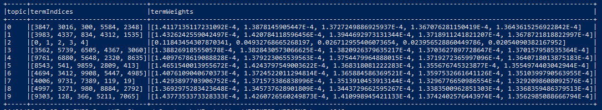

# Prérequis

Pour l'utiliser, assurez vous d'avoir `java11` installé et la variable d'environnement `JAVA_HOME` définie vers le dossier ou java11 est présent.

Il faudra aussi avoir sbt d'installer.

## Utilisation

Pour lancer le projet utiliser la commande à la racine du projet git:

```bash
sbt run -java-home $JAVA_HOME
ou alors  
sbt run -java-home "C:\Program Files\Java\jdk-11"
```

## Introduction

Pourquoi avoir choisi Spark Scala pour ce projet :

1. **Traitement de données massives** : Apache Spark est spécialement conçu pour le traitement efficace de grands ensembles de données répartis sur un cluster. Étant donné que nous travaillons avec des données de livres qui pourraient potentiellement être volumineuses, Spark offre des capacités de traitement parallèle qui permettent de traiter ces données de manière rapide et efficace.

2. **Traitement distribué** : Scala est bien adapté pour exploiter les fonctionnalités de Spark, notamment son API RDD (Resilient Distributed Dataset) qui permet de manipuler des données distribuées de manière transparente. Cela nous permet d'exploiter les capacités de calcul distribué de Spark pour des analyses efficaces, même sur de grandes quantités de données.

En résumé, Spark Scala est un choix approprié pour ce projet en raison de sa capacité à gérer efficacement de grandes quantités de données distribuée et sa performance globale.


Ce programme Scala utilise Apache Spark pour effectuer diverses analyses de texte, telles que le comptage de mots par ligne et la détermination de la moyenne et de la
médiane des mots par ligne dans un ensemble de données de livres.


On extrait les données des livres depuis un fichier .txt pour ensuite les nettoyer et les transformer dans des Dataframes lesquels on exploite pour produire les données.

Fonctionnalités : 
- Identification des nouveaux livres à partir des lignes contenant "ISBN".
- Agrégation du contenu par livre.
- Calcul du nombre de mots par ligne et par livre.
- Calcul de la moyenne et de la médiane des mots par ligne dans l'ensemble des livres.
- Création des visuels pour observer ces statistiques.


## Résultats

Les visualisations suivantes fournissent des insights sur la structure et la composition des données de livres analysées.

### Histogramme des Mots par Ligne
  
Cet histogramme illustre la fréquence de la quantité de mots présente sur les lignes des différents livres. Une concentration élevée dans une zone indique que de nombreuses lignes ont une longueur similaire, offrant un aperçu de la verbosité et du style d'écriture.

### Graphique de Dispersion des Mots Contre Lignes
  
Ce graphique de dispersion met en relation le nombre total de mots et le nombre de lignes pour chaque livre. Il aide à identifier les tendances et les anomalies, telles que les livres inhabituellement longs ou concis, en comparant la densité des mots aux lignes.

### Bar Chart du Nombre de Mots par Livre
  
Le diagramme en barres montre la quantité de mots contenus dans chaque livre. Cela révèle non seulement les livres les plus volumineux en termes de contenu textuel mais aussi la variété de longueurs parmi l'ensemble de la collection, ce qui peut être utile pour la sélection des ouvrages en fonction de leur densité de contenu.

La partie analyse 'Topic Modelling' à également était sérieusement avancé. Il manque encore l'exploitation de l'analyse dans un rendu visuel des données que nous voyons ci-dessous.


## Avertissement
Assurez-vous d'avoir suffisamment de ressources disponibles sur votre machine pour exécuter les analyses, car Apache Spark peut consommer beaucoup de mémoire et de puissance de calcul.

## Conclusion

Ce projet, utilisant Apache Spark avec Scala, démontre la puissance du traitement de données massives à travers l'analyse d'un ensemble de livres. Nous avons réussi à nettoyer, organiser et analyser des données textuelles pour en extraire des statistiques pertinentes et des visualisations intuitives. L'approche choisie souligne non seulement la flexibilité de Spark et Scala dans le domaine du Big Data mais également leur capacité à offrir des insights profonds sur des volumes de données importants.

L'intégration de fonctionnalités de topic modeling, bien que non terminée, est en bonne voie et promet d'ajouter une couche supplémentaire de compréhension en dévoilant les thèmes sous-jacents dans les textes analysés.